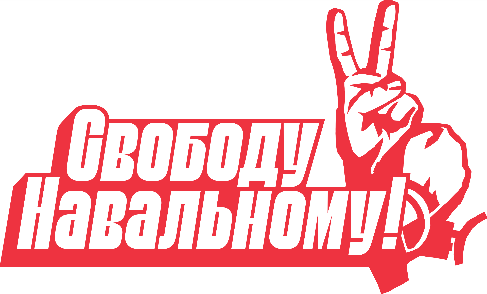

# Открытое письмо специалистов IT-индустрии в защиту Алексея Навального



Мы, работники IT-сферы, считаем, что свобода, закон и честное правосудие — главные условия развития нашей отрасли, экономики и страны в целом. Однако в последние месяцы мы наблюдаем, что ни от одного, ни от другого не осталось и следа. Все эти слова стали пустым звуком.

Неправомерное [задержание Алексея Навального в аэропорту](https://zona.media/online/2021/01/17/navalny), суд над ним [в здании ОВД Химки](https://zona.media/online/2021/01/18/navapolice), незаконное [заключение его в СИЗО](https://zona.media/online/2021/02/02/navalny_real) — это большой удар по правосудию в России.

Жестокие [задержания](https://ovdinfo.org/news/2021/01/23/spisok-zaderzhannyh-na-akciyah-v-podderzhku-alekseya-navalnogo-23-yanvarya-2021-goda) [более десяти тысяч человек](https://ovdinfo.org/news/2021/01/31/spisok-zaderzhannyh-na-akcii-v-podderzhku-alekseya-navalnogo-31-yanvarya-2021-goda) [за две недели](https://ovdinfo.org/news/2021/02/02/spisok-zaderzhannyh-v-svyazi-s-sudom-nad-alekseem-navalnym-2-fevralya-2021-goda), безумные штрафы и аресты участников мирных протестных акций и случайных людей — ничто иное, как уничтожение свободы собраний, гарантированной 31-й статьей Конституции.

**Мы требуем**:

1. Свободы Алексею Навальному
2. Прекращения "санитарного" уголовного дела по статье 236 против сотрудников Фонда борьбы с коррупцией и политических активистов.
3. Освобождения всех задержанных на акциях 23 и 31 января и 2 февраля.
4. Расследования всех фактов применения насилия силовиков в отношении протестующих.

Призываем коллег не оставаться в стороне и поддержать это письмо.

# Как подписаться

Вы можете это сделать, создав [в репозитории](https://github.com/wawan93/free-navalny) файл со случайным именем (простой способ создать уникальное имя файла — использовать *[генератор GUID](https://www.guidgenerator.com/online-guid-generator.aspx)*) в папку `signed`. В этом файле напишите строки
следующего формата (каждая строка — отдельный человек):
```
Фамилия Имя | Должность, компания
```

***

## Подписавшиеся

| #    | Фамилия и имя                      |  Должность, компания                    |
|------|------------------------------------|-----------------------------------------|
<!-- Signed -->
